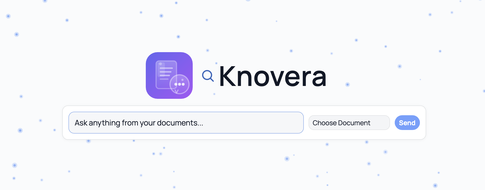

<div align="center">



# 🧠 Knovera

**Turn any document into a conversational knowledge base — with full multilingual support.**

[](https://www.python.org/)
[](https://fastapi.tiangolo.com/)
[](https://www.trychroma.com/)
[](https://ollama.com/)
[](#-license)
[](https://github.com/)

</div>

---

## ✨ What is Knovera?

Knovera is a **local-first, privacy-preserving RAG (Retrieval-Augmented Generation)** application that lets you upload PDFs and have intelligent conversations with their contents. Every answer is grounded **strictly in your documents** — the LLM never invents information from pre-trained knowledge.

> 🔒 Everything runs on your machine. No data ever leaves your system.

---

## 🚀 Features

| Feature | Description |
|---|---|
| 📄 **Multi-PDF Ingestion** | Upload one or many PDFs — digital text or mixed-language documents |
| 🌍 **Multilingual RAG** | Supports 24+ scripts and languages out of the box |
| 🔢 **Vector Search** | Converts chunks to embeddings and stores them locally in ChromaDB |
| 💬 **Real-time Streaming** | WebSocket-powered streaming answers token by token |
| 🧩 **Citations On/Off** | Toggle verbatim source excerpts per query |
| 🎯 **Smart Intent Engine** | Knows when you want a specific fact vs. a broad summary |
| 📚 **Dynamic Context** | Summary queries auto-boost retrieval depth and context budget |
| 🗂️ **Knowledge Bases** | Organize documents into named KBs and bind chats to them |
| 🤖 **Local LLM via Ollama** | Runs `qwen2.5` locally; falls back to extractive mode if unavailable |
| 🔒 **Strictly Extractive** | Answers come **only** from your documents, never invented |

---

## 🌐 Supported Languages

Knovera automatically detects and preserves text in any of these scripts:

<details>
<summary><b>🗺️ Click to expand full language support table</b></summary>

| Family | Scripts / Languages |
|---|---|
| 🟠 **Indic** | Hindi, Marathi, Sanskrit, Nepali (Devanagari), Bengali, Punjabi (Gurmukhi), Gujarati, Tamil, Telugu, Kannada, Malayalam, Odia, Sinhala |
| 🔵 **East Asian** | Chinese (Simplified & Traditional), Korean (Hangul), Japanese (Hiragana, Katakana) |
| 🟢 **Middle Eastern** | Arabic, Urdu, Persian |
| 🟣 **Southeast Asian** | Thai, Lao, Khmer (Cambodian), Myanmar (Burmese) |
| ⚪ **Other** | Russian, Ukrainian, Bulgarian (Cyrillic), Georgian, Armenian, Amharic/Tigrinya (Ethiopic), Tibetan |

</details>

Sentence splitting, embedding, retrieval, and citation are all **language-aware** end-to-end.

---

## 📦 Stack

```
FastAPI  ·  ChromaDB  ·  sentence-transformers  ·  PyMuPDF  ·  Ollama  ·  SQLite  ·  WebSockets
```

---

## ⚡ Quick Start

### 🟢 One Command (Recommended)

```bash
git clone <this-repo> knovera
cd knovera
bash ./bootstrap_knovera.sh
```

> Want Ollama set up automatically too?

```bash
BOOTSTRAP_OLLAMA=1 bash ./bootstrap_knovera.sh
```

Then open 👉 **[http://127.0.0.1:8000](http://127.0.0.1:8000)**

---

### 🔧 Manual Setup

<details>
<summary><b>Step-by-step instructions</b></summary>

**1. Create environment & install dependencies**
```bash
cd knovera
python3 -m venv .venv
source .venv/bin/activate
pip install -r requirements.txt
```

**2. (Optional but recommended) Start Ollama & pull model**
```bash
ollama serve
ollama pull qwen2.5:1.5b-instruct
```

**3. Start the app**
```bash
uvicorn app.main:app --reload
```

**4. Open the UI**
```
http://127.0.0.1:8000
```

</details>

---

## ⚙️ Configuration

Copy `.env.example` to `.env` and tweak as needed:

```env
APP_NAME="Knovera"
DATA_DIR=./data
UPLOAD_DIR=./data/uploads
CHROMA_DIR=./data/chroma
SQLITE_PATH=./data/app.db

# Embeddings
EMBEDDING_MODEL=sentence-transformers/paraphrase-multilingual-MiniLM-L12-v2
CHUNK_SIZE=900
CHUNK_OVERLAP=150

# LLM
OLLAMA_BASE_URL=http://localhost:11434
OLLAMA_MODEL=qwen2.5:1.5b-instruct
RETRIEVAL_TOP_K=3
MAX_CONTEXT_CHARS=3500
```

> [!NOTE]
> **Model Tips**
> - 🌍 `paraphrase-multilingual-MiniLM-L12-v2` — supports 50+ languages (default)
> - 🏃 `all-MiniLM-L6-v2` — smaller & faster if you only use English documents
> - ⚡ `qwen2.5:1.5b-instruct` — optimized for speed on local hardware (default)
> - 🧠 `qwen2.5:3b-instruct` — better quality, ~2× slower generation
> - ⚠️ Changing the embedding model requires **re-ingesting all documents**

---

## 🗄️ Resetting the Database

To completely wipe all vectors, chats, and uploads:

```bash
rm -rf ./data/chroma ./data/app.db ./data/uploads
```

---

## 📡 API Reference

<details>
<summary><b>📂 Documents</b></summary>

| Method | Endpoint | Description |
|---|---|---|
| `POST` | `/api/ingest` | Upload PDFs (multipart) |
| `GET` | `/api/documents` | List documents with ingestion status |
| `DELETE` | `/api/documents/{doc_id}` | Remove a document and its vectors |

</details>

<details>
<summary><b>🗂️ Knowledge Bases</b></summary>

| Method | Endpoint | Description |
|---|---|---|
| `GET` | `/api/knowledge-bases` | List all knowledge bases |
| `POST` | `/api/knowledge-bases` | Create a new knowledge base |
| `GET` | `/api/knowledge-bases/{kb_id}` | Get KB details |
| `POST` | `/api/knowledge-bases/{kb_id}/documents` | Add documents to a KB |
| `DELETE` | `/api/knowledge-bases/{kb_id}` | Delete a KB |

</details>

<details>
<summary><b>💬 Chats</b></summary>

| Method | Endpoint | Description |
|---|---|---|
| `GET` | `/api/chats` | List all chats |
| `POST` | `/api/chats` | Create a new chat |
| `GET` | `/api/chats/{chat_id}` | Chat detail with message history |
| `POST` | `/api/chats/{chat_id}/ask` | Ask a question (HTTP, non-streaming) |
| `WS` | `/api/chats/ws/{chat_id}` | Ask via WebSocket (streaming tokens) |
| `PATCH` | `/api/chats/{chat_id}/settings` | Update chat settings |
| `PATCH` | `/api/chats/{chat_id}/status` | Activate / deactivate chat |
| `PATCH` | `/api/chats/{chat_id}/identity` | Update user/assistant display names |
| `DELETE` | `/api/chats/{chat_id}` | Delete a chat |

</details>

<details>
<summary><b>🔍 Misc</b></summary>

| Method | Endpoint | Description |
|---|---|---|
| `POST` | `/api/query` | One-shot query against indexed docs |
| `GET` | `/health` | Health check |

</details>

📘 Full API docs and architecture notes live in [`docs/`](./docs/).

---

## 🏗️ Architecture Overview

```
┌─────────────────────────────────────────────────────┐
│                    Browser / Client                  │
└────────────────────┬────────────────────────────────┘
                     │  HTTP / WebSocket
┌────────────────────▼────────────────────────────────┐
│              FastAPI Application Layer               │
│  ┌──────────┐  ┌──────────┐  ┌───────────────────┐  │
│  │  Ingest  │  │  Chats   │  │  Knowledge Bases  │  │
│  └────┬─────┘  └────┬─────┘  └────────┬──────────┘  │
│       │             │                 │              │
│  ┌────▼─────────────▼─────────────────▼──────────┐  │
│  │            RAG Pipeline (Intent-Aware)         │  │
│  │  ┌─────────────┐   ┌──────────────────────┐   │  │
│  │  │  Retriever  │   │  Prompt Builder      │   │  │
│  │  │  (ChromaDB) │   │  (Dynamic Context)   │   │  │
│  │  └─────────────┘   └──────────────────────┘   │  │
│  └────────────────────────────────────────────────┘  │
│                         │                            │
│               ┌─────────▼──────────┐                 │
│               │   Ollama (Local)   │                 │
│               │  qwen2.5:1.5b-inst │                 │
│               └────────────────────┘                 │
└─────────────────────────────────────────────────────┘
        │                        │
┌───────▼────────┐    ┌──────────▼──────────┐
│   ChromaDB     │    │      SQLite          │
│ (Vector Store) │    │  (Chats / KBs meta)  │
└────────────────┘    └─────────────────────┘
```

---

## 🤝 Contributing

Contributions are very welcome! Here's how to get started:

1. 🍴 Fork the repository
2. 🌿 Create a feature branch: `git checkout -b feat/amazing-feature`
3. 💾 Commit your changes: `git commit -m 'feat: add amazing feature'`
4. 📤 Push to the branch: `git push origin feat/amazing-feature`
5. 🔃 Open a Pull Request

Please keep pull requests focused and include a clear description of what changed and why.

---

## 📄 License

This project is **open source**. See the repository for full license details.

---

<div align="center">

Made with ❤️ · Local-first · Privacy-preserving · Multilingual

</div>
